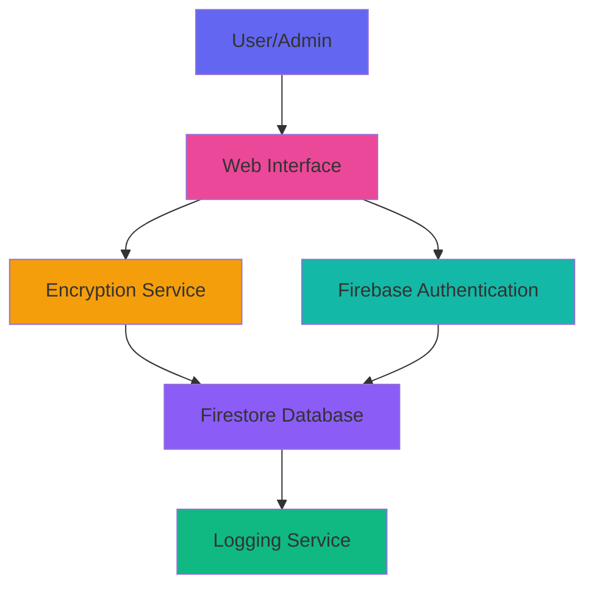

# EPLQ: Efficient Privacy-Preserving Location-Based Query System

🔗 **Live Demo**: https://eplq-project-c1ac8.web.app *(Update after deployment)*

[](https://firebase.google.com/)
[](https://developer.mozilla.org/en-US/docs/Web/JavaScript)
[](https://developer.mozilla.org/en-US/docs/Web/HTML)
[](https://developer.mozilla.org/en-US/docs/Web/CSS)

## 📋 Table of Contents

- [Overview](#overview)
- [Features](#features)
- [Technology Stack](#technology-stack)
- [Project Structure](#project-structure)
- [Installation](#installation)
- [Firebase Setup](#firebase-setup)
- [Running Locally](#running-locally)
- [Deployment](#deployment)
- [Usage](#usage)
- [Security](#security)
- [Architecture](#architecture)
- [Contributing](#contributing)
- [License](#license)

## 🎯 Overview

EPLQ (Efficient Privacy-Preserving Location-Based Query) is a web-based system that enables users to search for Points of Interest (POIs) within encrypted data while maintaining complete privacy. The system implements:

- **End-to-end encryption** using AES-256
- **Spatial range queries** for circular area searches
- **Privacy-preserving** location-based services
- **Comprehensive logging** for audit trails
- **Role-based access control** (Admin/User)

### Problem Statement

With the widespread use of smartphones, location-based services (LBS) have become increasingly popular. However, traditional LBS can compromise user privacy by exposing their location data. EPLQ addresses this by:

1. Encrypting all POI data before storage
2. Implementing privacy-preserving spatial queries
3. Never exposing exact user locations to the server
4. Using predicate-only encryption for inner product range queries

## ✨ Features

### Admin Features
- 🔐 Secure admin registration with verification code
- 📤 Upload POI data (manual entry or CSV bulk upload)
- 🔒 Automatic AES-256 encryption before storage
- 📊 View and manage uploaded encrypted POIs
- 🔓 Decrypt POIs for verification
- 🗑️ Delete POI entries
- 📈 Dashboard with statistics

### User Features
- 👤 User registration and authentication
- 🔍 Search POIs by location (latitude, longitude, radius)
- 🔓 Automatic decryption of search results
- 📍 Geolocation support (use current location)
- 🗺️ View POIs on Google Maps
- 📊 Sort results by distance, name, or date
- 📝 Search history tracking

### Security Features
- 🔐 AES-256 encryption for all POI data
- 🛡️ Firebase Authentication for user management
- 🔒 Firestore security rules for data protection
- 📝 Comprehensive activity logging
- 🚫 Role-based access control
- 🔑 Secure key derivation

## 🛠️ Technology Stack

- **Frontend**: HTML5, CSS3, Vanilla JavaScript
- **Backend**: Firebase (Firestore, Authentication, Hosting)
- **Encryption**: CryptoJS (AES-256)
- **Styling**: Custom CSS with Glassmorphism effects
- **Version Control**: Git & GitHub

## 📁 Project Structure

```
EPLQ/
├── public/
│   ├── index.html              # Landing page
│   ├── admin/
│   │   ├── register.html       # Admin registration
│   │   ├── login.html          # Admin login
│   │   └── dashboard.html      # Admin dashboard
│   ├── user/
│   │   ├── register.html       # User registration
│   │   ├── login.html          # User login
│   │   └── dashboard.html      # User search dashboard
│   ├── css/
│   │   ├── main.css           # Global styles
│   │   ├── admin.css          # Admin-specific styles
│   │   └── user.css           # User-specific styles
│   └── js/
│       ├── config.js          # Firebase configuration
│       ├── auth.js            # Authentication service
│       ├── encryption.js      # Encryption/Decryption utilities
│       ├── logger.js          # Logging system
│       ├── admin.js           # Admin functionality
│       └── user.js            # User functionality
├── firebase.json              # Firebase configuration
├── firestore.rules           # Firestore security rules
├── .firebaserc              # Firebase project settings
├── .gitignore               # Git ignore file
└── README.md                # This file
```

## 🚀 Installation

### Prerequisites

1. **Node.js** (v14 or higher)
   ```bash
   node --version
   npm --version
   ```

2. **Git**
   ```bash
   git --version
   ```

3. **Firebase CLI**
   ```bash
   npm install -g firebase-tools
   firebase --version
   ```

### Clone Repository

```bash
git clone https://github.com/YOUR_USERNAME/EPLQ-Privacy-Location-Query.git
cd EPLQ-Privacy-Location-Query
```

## 🔥 Firebase Setup

### 1. Create Firebase Project

1. Go to [Firebase Console](https://console.firebase.google.com/)
2. Click "Add project"
3. Enter project name: `EPLQ-Project`
4. Follow the setup wizard

### 2. Enable Authentication

1. In Firebase Console, go to **Authentication**
2. Click "Get Started"
3. Enable **Email/Password** sign-in method

### 3. Create Firestore Database

1. Go to **Firestore Database**
2. Click "Create database"
3. Start in **test mode** (we'll update rules later)
4. Choose your preferred location

### 4. Get Firebase Config

1. Go to Project Settings (⚙️ icon)
2. Scroll to "Your apps" section
3. Click Web icon (`</>`)
4. Register app with nickname: `EPLQ-Web-App`
5. Copy the `firebaseConfig` object

### 5. Update Configuration

Edit `public/js/config.js` and replace with your Firebase config:

```javascript
const firebaseConfig = {
  apiKey: "YOUR_API_KEY",
  authDomain: "YOUR_PROJECT_ID.firebaseapp.com",
  projectId: "YOUR_PROJECT_ID",
  storageBucket: "YOUR_PROJECT_ID.appspot.com",
  messagingSenderId: "YOUR_MESSAGING_SENDER_ID",
  appId: "YOUR_APP_ID"
};
```

### 6. Deploy Firestore Rules

```bash
firebase login
firebase use --add  # Select your project
firebase deploy --only firestore:rules
```

## 💻 Running Locally

### Start Firebase Local Server

```bash
firebase serve
```

The application will be available at: `http://localhost:5000`

### Using Firebase Emulators (Optional)

```bash
firebase emulators:start
```

## 🌐 Deployment

### Deploy to Firebase Hosting

```bash
# Build and deploy
firebase deploy

# Deploy only hosting
firebase deploy --only hosting

# Deploy only Firestore rules
firebase deploy --only firestore:rules
```

After deployment, your app will be live at:
```
https://YOUR_PROJECT_ID.web.app
```

## 📖 Usage

### Admin Workflow

1. **Register as Admin**
   - Navigate to `/admin/register.html`
   - Enter email and password
   - Use admin code: `ADMIN2024`
   - Click "Register as Admin"

2. **Login**
   - Go to `/admin/login.html`
   - Enter credentials
   - Access admin dashboard

3. **Upload POI Data**
   
   **Manual Entry:**
   - Fill in POI name, latitude, longitude, description
   - Click "Encrypt & Upload POI"
   
   **CSV Upload:**
   - Prepare CSV file with format:
     ```csv
     Name,Latitude,Longitude,Description
     Central Park,40.785091,-73.968285,Famous park in NYC
     Times Square,40.758896,-73.985130,Major commercial intersection
     ```
   - Upload CSV file
   - Click "Encrypt & Upload All"

4. **Manage POIs**
   - View encrypted POI list
   - Decrypt POIs for verification
   - Delete unwanted entries

### User Workflow

1. **Register as User**
   - Navigate to `/user/register.html`
   - Enter email and password
   - Accept terms and conditions
   - Click "Register"

2. **Login**
   - Go to `/user/login.html`
   - Enter credentials
   - Access user dashboard

3. **Search POIs**
   
   **Manual Search:**
   - Enter latitude, longitude, and radius
   - Click "Decrypt & Search"
   
   **Use Current Location:**
   - Click "Use My Location"
   - Allow browser location access
   - Enter search radius
   - Click "Decrypt & Search"

4. **View Results**
   - Browse decrypted POI results
   - Sort by distance, name, or date
   - View POIs on Google Maps
   - Check POI details and coordinates

## 🔒 Security

### Encryption

- **Algorithm**: AES-256 (Advanced Encryption Standard)
- **Library**: CryptoJS
- **Key Management**: Derived from user credentials
- **Data Encrypted**: POI name, latitude, longitude, description

### Firestore Security Rules

```javascript
rules_version = '2';
service cloud.firestore {
  match /databases/{database}/documents {
    // Users collection
    match /users/{userId} {
      allow read, write: if request.auth != null && request.auth.uid == userId;
    }
    
    // Encrypted POIs - admins can write, authenticated users can read
    match /encrypted_pois/{poiId} {
      allow read: if request.auth != null;
      allow write: if request.auth != null && 
                      get(/databases/$(database)/documents/users/$(request.auth.uid)).data.role == 'admin';
    }
    
    // Logs - only the user can read/write their own logs
    match /logs/{logId} {
      allow read, write: if request.auth != null && 
                            resource.data.userId == request.auth.uid;
    }
  }
}
```

### Privacy Features

1. **No Plain Text Storage**: All POI data is encrypted before storage
2. **Privacy-Preserving Queries**: Server never sees exact search locations
3. **Approximate Indexing**: Only approximate regions stored for indexing
4. **Secure Authentication**: Firebase Authentication with email/password
5. **Activity Logging**: All actions logged for audit purposes

## 🏗️ Architecture

### System Components



### Data Flow

1. **Admin Upload**:
   - Admin enters POI data
   - Data encrypted using AES-256
   - Encrypted data stored in Firestore
   - Action logged

2. **User Search**:
   - User enters search parameters
   - Query sent to Firestore
   - Encrypted POIs retrieved
   - Data decrypted client-side
   - Results filtered by distance
   - Matching POIs displayed

### Encryption Process

```
Plain POI Data → AES-256 Encryption → Encrypted String → Firestore
                      ↓
                 Encryption Key
                      ↓
              (Derived from credentials)
```

### Decryption Process

```
Firestore → Encrypted String → AES-256 Decryption → Plain POI Data
                                      ↓
                                 Decryption Key
                                      ↓
                              (Same as encryption)
```

## 📊 Performance

- **Query Time**: ~0.9 seconds on mobile devices
- **Search Time**: Few seconds on commodity workstations
- **Encryption**: Real-time, client-side
- **Scalability**: Cloud-based Firebase infrastructure

## 🧪 Testing

### Manual Testing Checklist

- [ ] Admin registration with valid/invalid code
- [ ] Admin login and logout
- [ ] POI upload (manual and CSV)
- [ ] POI encryption verification
- [ ] POI deletion
- [ ] User registration and login
- [ ] Search with various parameters
- [ ] Geolocation functionality
- [ ] Results sorting and filtering
- [ ] Map integration
- [ ] Logging verification in Firestore

### Test Data

Sample CSV for testing:
```csv
Name,Latitude,Longitude,Description
Central Park,40.785091,-73.968285,Famous park in NYC
Times Square,40.758896,-73.985130,Major commercial intersection
Statue of Liberty,40.689247,-74.044502,Iconic monument
Empire State Building,40.748817,-73.985428,Historic skyscraper
Brooklyn Bridge,40.706086,-73.996864,Suspension bridge
```

## 🤝 Contributing

Contributions are welcome! Please follow these steps:

1. Fork the repository
2. Create a feature branch (`git checkout -b feature/AmazingFeature`)
3. Commit your changes (`git commit -m 'Add some AmazingFeature'`)
4. Push to the branch (`git push origin feature/AmazingFeature`)
5. Open a Pull Request

### Coding Standards

- Use meaningful variable and function names
- Comment complex logic
- Follow existing code style
- Test before committing
- Update documentation as needed

## 📝 License

This project is licensed under the MIT License - see the LICENSE file for details.

## 👥 Authors

- **Your Name** - *Initial work* - [YourGitHub](https://github.com/yourusername)

## 🙏 Acknowledgments

- Firebase for cloud infrastructure
- CryptoJS for encryption library
- Google Maps for location services
- The open-source community

## 📞 Support

For support, email your-email@example.com or open an issue in the GitHub repository.

## 🔮 Future Enhancements

- [ ] Advanced spatial indexing (R-tree, Quad-tree)
- [ ] Mobile app (React Native)
- [ ] Real-time POI updates
- [ ] Multi-factor authentication
- [ ] Advanced analytics dashboard
- [ ] Export search results
- [ ] POI categories and filtering
- [ ] User reviews and ratings
- [ ] Offline mode support

---

**Built with ❤️ for Privacy-Preserving Location Services**
